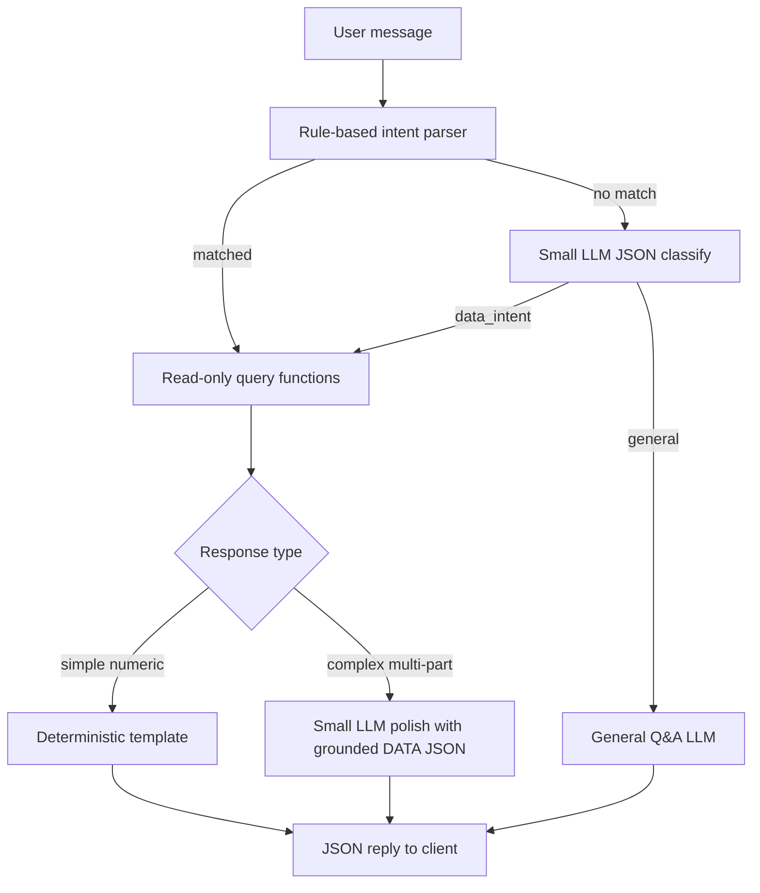

# Ask AI Chatbot — Implementation Plan

## Goal

Add a floating chat panel (like your reference screenshot) that:

- Answers **data questions** from existing DB tables (invoices, clients, companies, payments, recurring bills, imported invoices) without mutating anything
- Handles **general questions** (GST basics, how to use the app) via AI only
- Stays **low-cost**: rules + SQL for facts; AI only when needed (hybrid formatting per your choice)

## Architecture




**Safety invariant:** The chat module exposes **no INSERT/UPDATE/DELETE**. All queries live in a dedicated file with `SELECT` only, always filtered by `req.workspaceId` (same pattern as `[server/index.js](server/index.js)` invoice routes).

## Backend (new module)

Follow the existing pattern used by `[server/email.js](server/email.js)` and `[server/recurringBills.js](server/recurringBills.js)`: separate file + `registerAiChatRoutes()`.

### New files


| File                                                 | Responsibility                                                         |
| ---------------------------------------------------- | ---------------------------------------------------------------------- |
| `[server/aiChatQueries.js](server/aiChatQueries.js)` | Read-only SQL helpers; fuzzy client name resolution                    |
| `[server/aiChatIntents.js](server/aiChatIntents.js)` | Rule-based intent + parameter extraction (months, years, client names) |
| `[server/aiChat.js](server/aiChat.js)`               | Route handler, hybrid formatter, rate limits, LLM classify/polish      |
| `[server/aiChat.test.js](server/aiChat.test.js)`     | Unit tests for intents + queries (no live OpenAI)                      |


### Wire-up in `[server/index.js](server/index.js)`

```js
const { registerAiChatRoutes } = require('./aiChat');
registerAiChatRoutes({ app, db, importedDb, requireAuth });
```

Single new endpoint: `**POST /api/ai/chat**` (auth required via existing `apiAuthMiddleware`).

Request body: `{ message: string, history?: [{ role, content }] }` (history capped to last 4 turns server-side).

Response: `{ reply, source: 'template'|'llm'|'general', data?: object }`

### Intent types (MVP)


| Intent                             | Example question                             | Query                                     |
| ---------------------------------- | -------------------------------------------- | ----------------------------------------- |
| `invoice_count_by_client`          | "How many invoices issued to Hans I Tech?"   | COUNT by `clientId` (fuzzy name match)    |
| `invoice_amount_by_period`         | "How much invoice amount in June?"           | SUM(`total`) WHERE `invoiceDate` in month |
| `invoice_summary_by_client_period` | "Invoices to XYZ in June"                    | COUNT + SUM combined                      |
| `outstanding_summary`              | "Unpaid invoices?"                           | WHERE `status != 'paid'`                  |
| `client_search`                    | "Clients in Delhi?"                          | `clients` filter by state/city/name       |
| `workspace_stats`                  | "How many clients/companies?"                | Simple counts                             |
| `recurring_bills_summary`          | "Active recurring bills?"                    | `recurring_bills` read                    |
| `imported_invoices_summary`        | "Imported bills needing review?"             | `imported_invoices` by status             |
| `general`                          | "What is CGST?" / "How do I create invoice?" | LLM only, no DB                           |
| `unknown`                          | Unparseable                                  | Polite fallback + suggested chips         |


### Rule-based parser (cost saver — runs before any LLM)

`[server/aiChatIntents.js](server/aiChatIntents.js)` will detect:

- Month names: january–december (+ numeric `06`, `2025-06`)
- Phrases: `how many`, `how much`, `total`, `invoices for/to`, `issued to`, `unpaid`, `outstanding`
- Client name: remainder text fuzzy-matched against workspace clients (`LIKE` + simple score; if multiple matches, ask user to clarify in template — no AI needed)

If rules produce a confident intent + params → skip classify LLM entirely.

### Read-only queries (`[server/aiChatQueries.js](server/aiChatQueries.js)`)

Key functions (all take `workspaceId`):

```js
resolveClientByName(db, workspaceId, nameQuery)  // returns match or ambiguous list
countInvoicesByClient(db, workspaceId, { clientId, fromDate, toDate })
sumInvoiceAmountByPeriod(db, workspaceId, { year, month })
getOutstandingSummary(db, workspaceId)
// etc.
```

**June example:** user says "June" → `year` defaults to current calendar year unless year mentioned → query:

```sql
SELECT COUNT(*) AS count, COALESCE(SUM(total), 0) AS total
FROM invoices
WHERE workspaceId = ?
  AND invoiceDate >= ? AND invoiceDate < ?
```

**Client example:** fuzzy match `clients.name` in workspace → join `invoices` on `clientId`.

Uses existing columns from `[server/index.js](server/index.js)`: `invoices.invoiceDate`, `invoices.total`, `invoices.status` (`draft` | `paid`), `clients.name`, `clients.state`, `clients.city`.

### Hybrid response formatting


| Case                              | Method                                                                                                   | AI cost          |
| --------------------------------- | -------------------------------------------------------------------------------------------------------- | ---------------- |
| Single number/count/sum           | Template string                                                                                          | **0**            |
| Ambiguous client (2+ matches)     | Template listing options                                                                                 | **0**            |
| Multi-metric or compound question | One `callOpenAIChatCompletions` with `DATA: {...}` injected; system prompt: *only use numbers from DATA* | **1 small call** |
| General / app help                | One LLM call, no DB                                                                                      | **1 call**       |
| Unclassified after rules          | One classify JSON call → then above                                                                      | **1–2 calls**    |


Reuse `[server/openai.js](server/openai.js)` `callOpenAIChatCompletions` + `getOpenAIConfig()` with new env `AI_CHAT_TIMEOUT_MS` (default 8000) and `max_tokens` capped (~300).

**No OpenAI key:** data questions still work via templates; general questions return a friendly "AI not configured" message.

### Rate limits and kill switch

Store usage in `**email.db`** (separate from `invoices.db` — no risk to invoice/client/company data):

```sql
CREATE TABLE IF NOT EXISTS ai_chat_usage (
  workspaceId TEXT NOT NULL,
  usageDate TEXT NOT NULL,  -- YYYY-MM-DD
  messageCount INTEGER DEFAULT 0,
  PRIMARY KEY (workspaceId, usageDate)
);
```

Env vars (add to `[.env.example](.env.example)`):

- `AI_CHAT_ENABLED=1` — master kill switch
- `AI_CHAT_DAILY_LIMIT=50` — per workspace per day (LLM calls only; template replies don't increment)
- `AI_CHAT_MAX_TOKENS=300`

## Frontend (new component)

### New files


| File                                                                         | Responsibility                                                                           |
| ---------------------------------------------------------------------------- | ---------------------------------------------------------------------------------------- |
| `[client/src/components/AskAIChat.js](client/src/components/AskAIChat.js)`   | Floating button + expandable panel                                                       |
| `[client/src/components/AskAIChat.css](client/src/components/AskAIChat.css)` | Styles matching existing gold/navy theme from `[client/src/App.css](client/src/App.css)` |


### Mount in `[client/src/App.js](client/src/App.js)`

Render `<AskAIChat />` inside `AppShell` (after login), not on `/login`.

### UI behavior

- Fixed bottom-right toggle button
- Panel: title "Ask AI", subtitle *"Search your invoices, clients, and payments"*
- Suggested chips (click to send):
  - "How many invoices this month?"
  - "Total invoice amount in June"
  - "Which invoices are unpaid?"
  - "How many clients do we have?"
- Message list (user + assistant bubbles)
- Loading state while `POST /api/ai/chat`
- Disclaimer: *"AI answers are based on your workspace data. Verify figures for compliance."*
- Uses existing `[client/src/utils/api.js](client/src/utils/api.js)` `apiJson('/api/ai/chat', ...)`

## Data safety checklist

- No writes to `invoices`, `clients`, `companies`, `invoice_items`, `invoice_payments`
- `imported_invoices` read-only only
- No admin routes exposed through chat
- All SQL in one audited file; no dynamic SQL from LLM
- LLM never receives raw DB dumps — only small aggregated JSON (counts, sums, names)

## Tests (`[server/aiChat.test.js](server/aiChat.test.js)`)

In-memory SQLite (pattern from `[server/taxCodes.test.js](server/taxCodes.test.js)`):

- `parseMonth("June 2025")` → `{ year: 2025, month: 6 }`
- `resolveClientByName` fuzzy match + ambiguity
- `sumInvoiceAmountByPeriod` with seeded invoices
- `countInvoicesByClient` for named client
- Template formatter output for simple cases
- Rate limit increment logic

## Effort estimate


| Piece                                       | Time          |
| ------------------------------------------- | ------------- |
| Query + intent layer + tests                | ~1.5 days     |
| Chat route + hybrid formatter + rate limits | ~1 day        |
| React UI component                          | ~0.5–1 day    |
| Manual QA on real workspace data            | ~0.5 day      |
| **Total**                                   | **~3–4 days** |


## Out of scope (later)

- Chat actions (create invoice, edit client) — explicitly excluded for safety
- Conversation persistence across sessions
- Streaming responses
- Bank/cash flow (no bank data in DB yet)

